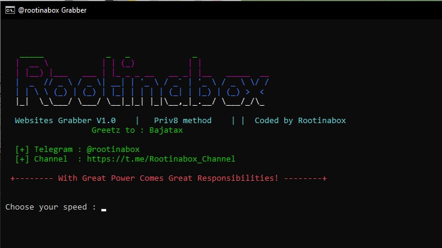

# Mass Websites Grabber


## What can it do?
This project aims to provide an easy-to-use python tool for grabing websites links. This can be useful for data uses as well as pentesting purposes.

This tool however only grab the websites links from all possible IPs (from 0.0.0.0 to 265.265.265)

---

## Requirements
* Python 3 or 2.7.14
* pip
* requests (see [Installation](#Installation))
* coloraama (see [Installation](#Installation))

---

## Installation
You can just install the dependencies using pip: `pip install -r requirements.txt`

If you want to manually install the required packages using your preferrec package manager, see [requirements.txt](requirements.txt) for a list of packages

---
**Linux**
```bash
apt install git python3-pip
git clone https://github.com/rootinabox/Mass-Websites-Grabber
cd Mass-Websites-Grabber 
pip3 install colorama
pip3 install requests
python3 privategrabber.py
```
**Windows**
```
install python 2.7.14 or 3 ( add python to path )
pip install requests
pip install colorama
python privategrabber.py
```



## Issues & Features
If you find any problems or have a feature request, feel free to contact me.

Telegram : @rootinabox

Channel  : https://t.me/Rootinabox_Channel
---
